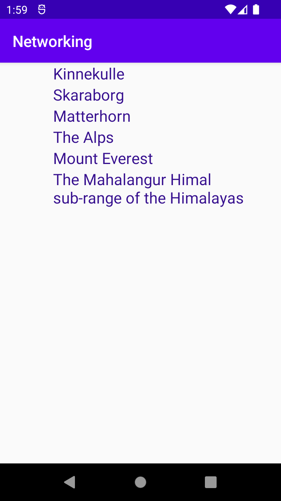

Först så skapads en klass med namnet “Mountain” och sen lade till klasser attribut
namn och plats,  därefter konstruktor, samt getter och setter för dessa attribut.
Sedan skaps mountain_view layout, så att varie mountain kan ha en enda layout
Lade en Recycler View till i layoutfilen för aktiviteten, och skapdes alla java classes.
Därefter för Rycyclerview behövs Viewholder och Adapterholder, och då skapas två klasser för var
och en av dem. Sen la till mountain listan från Json filen. använde getjson metod som hämtar 
Json-data från Json-URl.lägger till dem bergen med andra skapdes berg, så att dem visas i samma
lista.

Den här koden använder en AsyncTask för att hämta Json-data som konventerar datan till en lista 
över bergobjekt med hjälp av Gson Bibliotektet.

public void onPostExecute(String json) {
Log.d("MainActivity", ""+json);
Gson gson = new Gson();
Type type = new TypeToken<List<Mountain>>(){}.getType();
List<Mountain> mountains= gson.fromJson(json, type);

         RecyclerView recyclerView = findViewById(R.id.recycler_view);
         recyclerView.setLayoutManager(new LinearLayoutManager(this));
         recyclerView.setAdapter(new MyAdapter(getApplicationContext(), mountains));

    }
    private void getJson() {
        new JsonFile(this, this).execute(JSON_FILE);
    }

}

